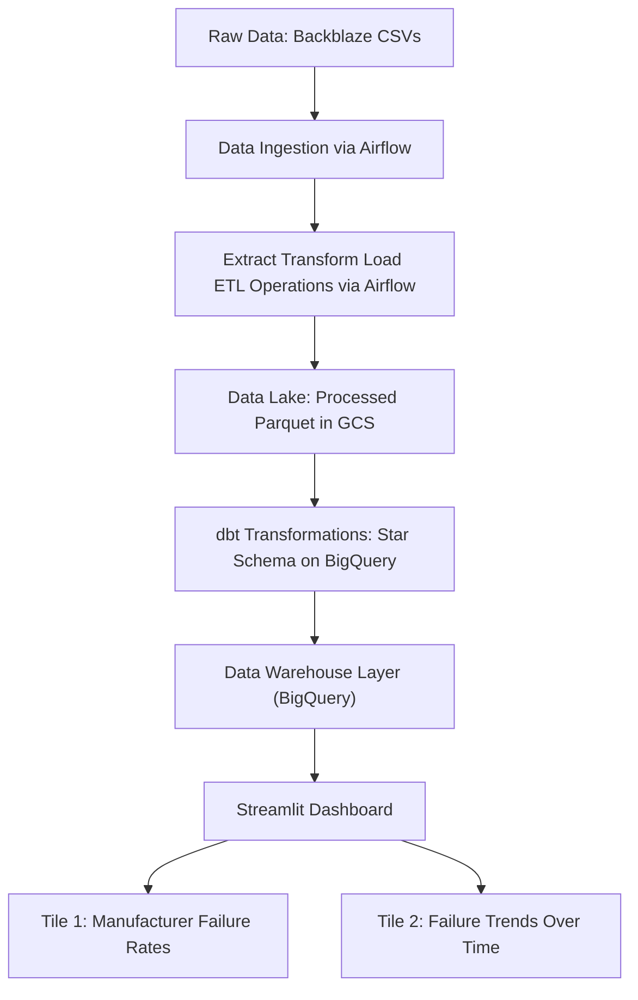

# 📊 Project Plan: Storage Drive Analytics Dashboard

### 🚧 Status: <span style="color: #dfa018ff;">Work in Progress</span>

> **Project Title**: Storage Drive Analytics Dashboard  
> **Dataset Source**: Backblaze Storage Drive Data  
> **Cloud Provider**: Google Cloud Platform (GCP)  
> **Data Lake**: Google Cloud Storage (GCS)  
> **Data Warehouse**: BigQuery  
> **ETL & Batch Processing**: Apache Airflow (Python)
> **Data Transformation**: dbt (Python + SQL)  
> **Orchestration**: Apache Airflow (Python) (Docker Container)
> **Dashboard**: Streamlit  
> **Infrastructure as Code**: Terraform  
> **Containerization**: Docker  

---

## 📖 Table of Contents

1. Project Overview  
2. Dataset & Scope  
3. Architecture & Data Flow
4. Technology Stack  
5. How to Run - Installation and execution guide.

---

## 📌 Project Overview

### **Problem Statement: Empowering Users with Drive Reliability Data**

**The Context & Problem**

Data is precious—whether it’s irreplaceable family memories, years of creative work, or critical business records. Yet, many everyday users (photographers, home labbers, small business owners) rely on consumer-grade drives they can’t afford to replace frequently. They are often blind to the hidden risks: specific models may fail unpredictably, leading to catastrophic data loss and financial hit. Currently, people buy storage based on marketing hype (speed/capacity) rather than empirical evidence of real-world longevity.

**The Solution**

This end-to-end data engineering project bridges that gap by turning enterprise-grade telemetry into actionable intelligence for everyone. By ingesting daily health snapshots from Backblaze, I extract, transform, and visualize granular S.M.A.R.T. data. The resulting dashboard answers the critical questions: Which models hold up over time? Which brands are ticking time bombs?

**Who This Helps**
- Creators & Photographers: Who need reliable archival storage but can't rely solely on volatile system drives.
- Home Lab Enthusiasts: Building their first NAS and needing to know which drives survive the long haul before establishing redundancy.
- Small Businesses: Seeking secure data retention without enterprise-grade IT budgets.
- Casual Users: Anyone wanting peace of mind that their personal digital collection will last.

**Roadmap & Project Status (Important Note)**

*This project currently represents a Minimum Viable Product (MVP). Due to the upcoming expiration of my Google Cloud trial credits, I am pivoting this initiative toward fully open-source and self-hosted infrastructure to ensure long-term sustainability and accessibility.*

**The Goal**

Democratizing access to drive reliability data. By shifting users from passive trust in marketing to active, evidence-based decision-making, we empower them to select hardware that truly safeguards their most valuable information against the inherent risks of mechanical failure.

This project ingests, processes, transforms, and visualizes Backblaze’s storage drive failure dataset to build a dashboard that displays:
- **KPI Metric 1**: Most Recent Active Drives
- **KPI Metric 2**: Total Failed Drives 
- **Visual Chart 1**: Distribution of hard drive failure rates by manufacturer (categorical).  
- **Visual Chart 2**: Active and failed storage drive trends over time (stacked bar chart).
- **Table 1**: List of models, total drives, failed drives, and failure rate by quarter

The pipeline is **batch-oriented**, orchestrated via Apache Airflow (Docker container), with Python-based ETL tasks and dbt for transformations. BigQuery stores final star schema tables, and Streamlit provides the interactive dashboard. Infrastructure is provisioned via Terraform and containerized using Docker.

---

## 📦 Dataset & Scope

- **Source**: Backblaze Hard Drive Data
- **Format**: CSV (multiple files)  
- **Columns of Interest**:  
  - `model` (manufacturer)   
  - `failure_indicator`     
- **Scope**:  
  - Focus on failure trends and manufacturer reliability.  
  - Time range: 2024–2025 (as available).
  - Data cleaning: handle missing values, standardize dates, deduplicate.

---

## 🔄 Architecture & Data Flow



> **Notes**:  
> - **GCS** serves as the data lake (raw and processed Parquet).  
> - **Apache Airflow** orchestrates all ETL tasks within a Docker container.
> - **Airflow Tasks**: download_data(), extract_data(), convert_csv_to_parquet(), upload_to_gcs()
> - **dbt** runs transformations for star schema generation in BigQuery.
> - **BigQuery** stores final star schema tables.  
> - **Streamlit** pulls data from BigQuery via `google-cloud-bigquery` Python client.

---

## 🛠️ Technology Stack

| Layer              | Technology             | Purpose                                                                 |
|--------------------|------------------------|-------------------------------------------------------------------------|
| Cloud              | Google Cloud           | Hosting GCS, BigQuery, Compute Engine, Airflow                         |
| Data Lake          | Google Cloud Storage   | Raw and processed Parquet data storage                                |
| Data Warehouse     | BigQuery               | Optimized storage and querying for dashboard                         |
| ETL & Batch        | Apache Airflow (Python)| ETL jobs via `@dag` and `@task` decorators with Pandas/PyArrow         |
| Transformation     | dbt                    | Define transformations (e.g., star schema)                            |
| Dashboard          | Streamlit              | Interactive UI with two tiles                                         |
| Infrastructure     | Terraform              | Provision GCS, BigQuery, Airflow, compute instances                    |
| Containerization   | Docker                 | Package Airflow + ETL + dbt apps for reproducibility                  |

---

## How to Run the Project
Follow these steps to deploy, run, and visualize your Storage Drive Analytics Dashboard Using Google Cloud.

1. Prerequisites
    - A valid Google Cloud Platform (GCP) account
    - A Google Cloud Service Account with the following assigned role accesses:
        - BigQuery Admin
        - Storage Admin
        - Storage Object Admin
    - gcloud CLI installed and authenticated (gcloud auth application-default login).
    - Git (to clone this repository).
    - Docker CLI and Docker Compose installed
    - Terraform installed

> Note: Since the original development environment was done on a Ubuntu/Debian Desktop Linux, you may need to adjust certain commands or file path structures if you are using a different operating system. In addition, the templates provided assume you will save Google credentials in .google/credentials and navigate to specific folders as instructed.

2. Clone the Repository
    - `git clone https://github.com/ammartin8/hard_drive_analytics_dashboard.git`
    - `cd hard_drive_analytics_dashboard`

3. Configure Secrets & Environment
    - In the project root folder (hard_drive_failure_analytics_dashboard/), rename the .env.example file to `.env`
    - Edit the .env file by assigning your google project ID, and google cloud bucket environment variables. You can cahnage the airflow environment variables as well. Be sure to recall the `AIRFLOW_USER` and `AIRFLOW_PASSWORD` values as you'll need them to log into the Airflow UI.
    - Create a `.google/credentials` directory in the project root folder `hard_drive_failure_analytics_dashboard/` and export your service account key you created in Google Cloud Platform as a json file and store it in the following directory in your project project folder:
    ```
    hard_drive_failure_analytics_dashboard <---- project root folder
    ├── .google
    │   ├── credentials
    │   │   └── google_credentials.json
    ```

Note: Since the `docker-compose.yaml` references your service account as `google_credentials.json`, you should save your service account key with the same name; otherwise, you will need to update the name as referenced in the `docker-compose.yaml` file

4. Infrastructure Provisioning
    - This project uses Terraform to provision GCS buckets, BigQuery datasets, and the Airflow container environment.

### Navigate to the terraform directory
`cd ./terraform`

### Create a variables.tf file and populate the default fields as needed
Go to the [example.variables.tf](./terraform/example.variables.tf) file, rename the file to `variables.tf` and update the file by adding your project id, storage bucket name, and change location/region if needed.

### Initialize Terraform providers
Run `terraform init`

### Apply infrastructure code to create GCS and BigQuery resources
- Run `terraform plan` to double check that the assigned values and resources are correct.
- After verifying run `terraform apply` and enter yes to provision resources.


>Note: This will create a bucket in data-lake and dataset in BigQuery.

5. Trigger Data Ingestion

#### Airflow Instructions
The pipeline is batch-oriented. Run the Airflow DAG to download and process data:
1. Make sure you are in the project root directory first: `hard_drive_failure_analytics_dashboard/`
2. Make sure the following directories exists, if not please create them: 
    - ./airflow/config 
    - ./airflow/dags 
    - ./airflow/logs 
    - ./airflow/plugins

Setup should look similar to such:
```
hard_drive_failure_analytics_dashboard <-------project root directory
└── airflow
    ├── config
    ├── dags
    ├── logs
    └── plugins
```

>Note: On **Linux**, the quick-start needs to know your host user id and needs to have group id set to `0`. Otherwise the files created in `dags`, `logs`, `config` and `plugins` will be created with `root` user ownership. You have to make sure to configure them for the docker-compose:

To get your user id, run `id -u` in your terminal to get your user ID, then update `AIRFLOW_UID` in your .env file with that number.

For other operating systems, you may get a warning that AIRFLOW_UID is not set, but you can safely ignore it. You can also manually add the assigned value below in the .env file to get rid of the warning:

```
AIRFLOW_UID=50000
```

Now you can run the airflow image:
`docker compose up -d`

This process will do the following: 
- build a custom lighter version docker build for airflow
- Install uv python package manager
- Create virtual environment
- Install python dependencies based on uv.lock file

> Note: Sometimes the airflow docker build seems fails for some reason, try to rerun and it should build successfully. In addition, upon first run, it make take time for the docker containers to all be started. The hard_drive_analytics_dashboard-airflow-init-1 container typically can take up to 5-10 minutes to start depending on compute resources.


## Airflow ETL Process
Once airflow docker image is up and running, head to `http://localhost:8080` and login to airflow using the assigned credentials in your .env file. Once logged in go to The left sidebar and click `Admin` then `Connections`. To run data_etl_v2 pipeline, you must set up a Google Cloud connection in airflow UI first.
- Select `Add Connection`
- In the Connection ID enter: `gcp`
- In Connection Type search for `Google Cloud` and select it
- Select `Extra Fields` and in `Keyfile Path` section, input file path to your google credentials: `/.google/credentials/google_credentials.json`
- Go to bottom of form and click `Save`
- Test your connection by going to far right and clicking the line-chart symbol (next to edit button). The connection turns green you connected! If not, double check to make sure you have the correct file path to your google_credential.json file as referenced in the docker container.
- In the left sidebar, go to `Dags` > click on `data_etl_v2` workflow > then click on `Trigger` play button in top-right corner of UI > and select `Single Run`. 

>**Special Note & Considerations:** The data_etl_v2.py is currently set to download only 1 zip file `2025 Q4 data only (unzipped ~12 GB of data)!` Extracting all 2024 & 2025 years would be unzipped ~87.3 GB of data. Depending on compute resources run can take time (for me it was 5-7 mins for 1 year of data on a local machine). 
>
>If you have limited resources I would recommend keeping to just downloading one file just for demo testing. Otherwise, you can update the [data_etl_v2.py](./airflow/dags/data_etl.py) file in the airflow/dags folder and update `YR_START`, `YR_END`, and `QTR_START` and `QTR_END` data fields to pull more data.
>
>*For reference on a laptop with 15 GB of RAM and 12 cores CPU, took 26 minutes to download 2 full years of data.

The etl process is downloading zip file from source > extract zip file > converting to parquet > then loading to GCS.

## BigQuery Process
- Verify that files are loaded in your Google Cloud Storage bucket.
- In BigQuery Studio open to new blank SQL query page then update, copy/paste and run the following SQL commands in BigQuery to create your source datasets: [BigQuery_SQL_Cmd.sql](docs/BigQuery_SQL_Cmd.sql)

> **Partition Strategy**
>
> The materialized source table is set to be partition by combination of year and month. Since the dashboard is currently setup to report by month or quarter it seems to make sense to set up to partition by year_month that way, the partition sizes are not too big or too small and it will be easy to query the data by month, quarter, and year as they will likely be the most common filters used.

## dbt Process
1. In terminal go to dbt folder: `cd dbt`
2. If your virtual env folder hasn't be created yet run `uv run dbt --version` (this will install all packages into your virtual environment and check the dbt version). Upon completion, the dbt version should output in command line. 
3. Two ways to run dbt commands (choose one as either way works the same):
    - (Option 1) Use .venv virtual environment and run dbt commands as normal. 
        1. activate .venv environment: `source ../.venv/bin/activate`
    - (Option 2) Always add `uv run` before running any dbt commands
4. Make sure you in the dbt folder (`cd dbt`), run `source ../../.env` to import environment variables from project root
> Note: You  may get a error message in your dbt_project.yml file stating dbt configuration is invalid. You can safely ignore this error since this is likely due to dbt not recognizing that dbt is installed in a virtual environment instead of the local machine.
5. Run `dbt debug --profiles-dir=./profiles --project-dir=./hard_drive_data` to test if connection is working. If checks failed address issues. Common solutions to issues include:
  - Make sure the project ID is correct in profile.yml
  - Make sure you are running commands while in dbt folder since profile-dir and project-dir references from the `dbt/` folder
  - Make sure your google_credential.json file is in correct folder. As alternative you can replace the relative path in your `profile.yml` file and put the absolute file path instead.
6. Run `dbt deps --profiles-dir=./profiles --project-dir=./hard_drive_data` or `uv run dbt deps --profiles-dir=./profiles --project-dir=./hard_drive_data` to install dbt packages
7. Run `dbt build --profiles-dir=./profiles --project-dir=./hard_drive_data` or `uv run dbt build --profiles-dir=./profiles --project-dir=./hard_drive_data` to build, test, and create all data models

## Locally Running Streamlit App
- In the terminal go to the project root directory: `hard_drive_failure_analytics_dashboard/`
- Run `uv run streamlit run webapp/dashboard_app.py` or `streamlit run webapp/dashboard_app.py` if your virtual environment is active in terminal.
- If you are not automatically redirected, go to `http://localhost:8501`.
- After a few moments the Storage Drive Analytics Dashboard should appear.

## And finally, Thank you! 
Thank you very much for taking the time to review my project, if you came across any issues please feel free to contact me by submitting an issue on Github! If found you had to run alternative commands due to being Mac or Windows, please feel free to submit an issue and I can add instructions in the README.md for others to follow.