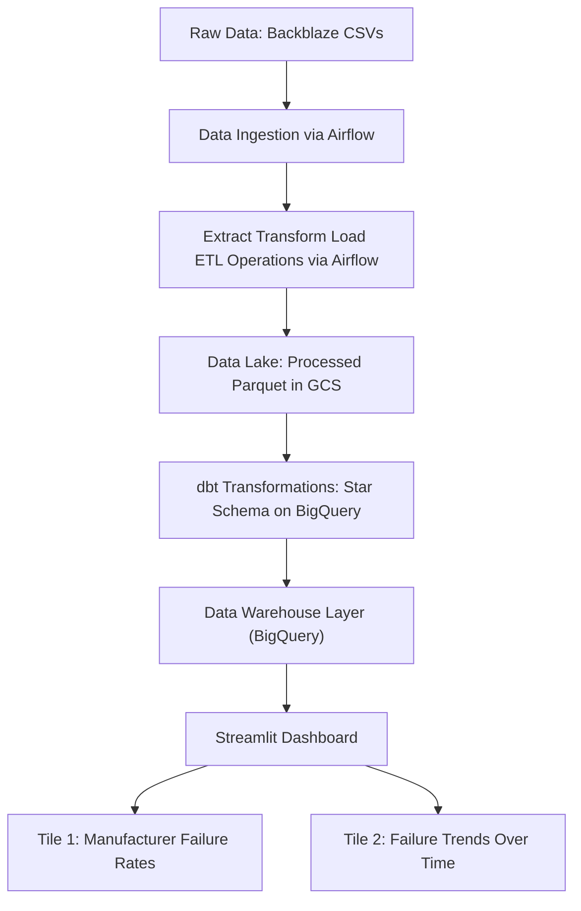

# 📊 Project Plan: Storage Drive Analytics Dashboard

### 🚧 Status: <span style="color: #dfa018ff;">Work in Progress</span>

> **Project Title**: Storage Drive Analytics Dashboard  
> **Dataset Source**: Backblaze Storage Drive Data  
> **Cloud Provider**: Google Cloud Platform (GCP)  
> **Data Lake**: Google Cloud Storage (GCS)  
> **Data Warehouse**: BigQuery  
> **ETL & Batch Processing**: Apache Airflow (Python)
> **Data Transformation**: dbt (Python + SQL)  
> **Orchestration**: Apache Airflow (Python) (Docker Container)
> **Dashboard**: Streamlit  
> **Infrastructure as Code**: Terraform  
> **Containerization**: Docker  

---

## 📖 Table of Contents

1. Project Overview  
2. Dataset & Scope  
3. Architecture & Data Flow
4. Technology Stack  
5. How to Run - Installation and execution guide.

---

## 📌 Project Overview

### **Problem Statement: Empowering Users with Drive Reliability Data**

**The Context & Problem**

Data is precious—whether it’s irreplaceable family memories, years of creative work, or critical business records. Yet, many everyday users (photographers, home labbers, small business owners) rely on consumer-grade drives they can’t afford to replace frequently. They are often blind to the hidden risks: specific models may fail unpredictably, leading to catastrophic data loss and financial hit. Currently, people buy storage based on marketing hype (speed/capacity) rather than empirical evidence of real-world longevity.

**The Solution**

This end-to-end data engineering project bridges that gap by turning enterprise-grade telemetry into actionable intelligence for everyone. By ingesting daily health snapshots from Backblaze, I extract, transform, and visualize granular S.M.A.R.T. data. The resulting dashboard answers the critical questions: Which models hold up over time? Which brands are ticking time bombs?

**Who This Helps**
- Creators & Photographers: Who need reliable archival storage but can't rely solely on volatile system drives.
- Home Lab Enthusiasts: Building their first NAS and needing to know which drives survive the long haul before establishing redundancy.
- Small Businesses: Seeking secure data retention without enterprise-grade IT budgets.
- Casual Users: Anyone wanting peace of mind that their personal digital collection will last.

**Roadmap & Project Status (Important Note)**

*This project currently represents a Minimum Viable Product (MVP). Due to the upcoming expiration of my Google Cloud trial credits, I am pivoting this initiative toward fully open-source and self-hosted infrastructure to ensure long-term sustainability and accessibility.*

**The Goal**

Democratizing access to drive reliability data. By shifting users from passive trust in marketing to active, evidence-based decision-making, we empower them to select hardware that truly safeguards their most valuable information against the inherent risks of mechanical failure.

This project ingests, processes, transforms, and visualizes Backblaze’s storage drive failure dataset to build a dashboard that displays:
- **KPI Metric 1**: Most Recent Active Drives
- **KPI Metric 2**: Total Failed Drives 
- **Visual Chart 1**: Distribution of hard drive failure rates by manufacturer (categorical).  
- **Visual Chart 2**: Active and failed storage drive trends over time (stacked bar chart).
- **Table 1**: List of models, total drives, failed drives, and failure rate by quarter

The pipeline is **batch-oriented**, orchestrated via Apache Airflow (Docker container), with Python-based ETL tasks and dbt for transformations. BigQuery stores final star schema tables, and Streamlit provides the interactive dashboard. Infrastructure is provisioned via Terraform and containerized using Docker.

---

## 📦 Dataset & Scope

- **Source**: Backblaze Hard Drive Data
- **Format**: CSV (multiple files)  
- **Columns of Interest**:  
  - `model` (manufacturer)   
  - `failure_indicator`     
- **Scope**:  
  - Focus on failure trends and manufacturer reliability.  
  - Time range: 2024–2025 (as available).
  - Data cleaning: handle missing values, standardize dates, deduplicate.

---

## 🔄 Architecture & Data Flow



> **Notes**:  
> - **GCS** serves as the data lake (raw and processed Parquet).  
> - **Apache Airflow** orchestrates all ETL tasks within a Docker container.
> - **Airflow Tasks**: download_data(), extract_data(), convert_csv_to_parquet(), upload_to_gcs()
> - **dbt** runs transformations for star schema generation in BigQuery.
> - **BigQuery** stores final star schema tables.  
> - **Streamlit** pulls data from BigQuery via `google-cloud-bigquery` Python client.

---

## 🛠️ Technology Stack

| Layer              | Technology             | Purpose                                                                 |
|--------------------|------------------------|-------------------------------------------------------------------------|
| Cloud              | Google Cloud           | Hosting GCS, BigQuery, Compute Engine, Airflow                         |
| Data Lake          | Google Cloud Storage   | Raw and processed Parquet data storage                                |
| Data Warehouse     | BigQuery               | Optimized storage and querying for dashboard                         |
| ETL & Batch        | Apache Airflow (Python)| ETL jobs via `@dag` and `@task` decorators with Pandas/PyArrow         |
| Transformation     | dbt                    | Define transformations (e.g., star schema)                            |
| Dashboard          | Streamlit              | Interactive UI with two tiles                                         |
| Infrastructure     | Terraform              | Provision GCS, BigQuery, Airflow, compute instances                    |
| Containerization   | Docker                 | Package Airflow + ETL + dbt apps for reproducibility                  |

---

## How to Run the Project
Follow these steps to deploy, run, and visualize your Storage Drive Analytics Dashboard Using Google Cloud.

1. Prerequisites
    - A valid Google Cloud Platform (GCP) account
    - A Google Cloud Service Account with the following assigned role accesses:
        - BigQuery Admin
        - Storage Admin
        - Storage Object Admin
    - gcloud CLI installed and authenticated (gcloud auth application-default login).
    - Git (to clone this repository).
    - Docker CLI and Docker Compose installed
    - Terraform installed

> Note: Since the original development environment was done on a Ubuntu/Debian Desktop Linux, you may need to adjust certain commands or file paths if you are using a different operating system.

2. Clone the Repository
    - `git clone https://github.com/ammartin8/hard_drive_analytics_dashboard.git`
    - `cd hard_drive_analytics_dashboard`

3. Configure Secrets & Environment
    - In the project root folder (hard_drive_failure_analytics_dashboard/), create a local .env file
    - Edit .env by assigning your postgres username/password, airflow username/password, google project ID
    - Export your service account key you created in Google Cloud Platform as a json file and store it in the following directory in your project project folder (you will need to create the .google/credentials directory as well):
    ```
    hard_drive_failure_analytics_dashboard
    ├── .google
    │   ├── credentials
    │   │   └── google_credentials.json
    ```

Note: Since the `docker-compose.yaml` references your service account as `google_credentials.json`, you should save your service account key with the same name; otherwise, you will need to update the name as referenced in the `docker-compose.yaml` file

4. Infrastructure Provisioning
    - This project uses Terraform to provision GCS buckets, BigQuery datasets, and the Airflow container environment.


### Navigate to the terraform directory
`cd ./terraform`

### Create a variables.tf file and populate the default fields as needed:
```
variable "credentials" {
  description = "credentials"
  default     = "../.google/credentials/google_credentials.json"
}

variable "project_name" {
  description = "Project name"
  default     = "my-project-name" # Update me
}

variable "location" {
  description = "Project Location"
  default     = "US" # Update me
}

variable "region" {
  description = "Region"
  default     = "us-central1" # Update me
}

variable "google_bigquery_dataset_name" {
  description = "BigQuery dataset name"
  default     = "hard_drive_dataset"
}

variable "google_storage_bucket_name" {
  description = "Bucket storage name"
  default     = "my-gcs-bucket-name" # Update me
}

variable "google_storage_class" {
  description = "Bucket storage class"
  default     = "STANDARD"
}
```

### Initialize Terraform providers
`terraform init`

### Apply infrastructure code to create GCS, BQ, and Compute Engine resources
`terraform apply`

Note: This will create a bucket in data-lake and dataset in BigQuery.

5. Trigger Data Ingestion

The pipeline is batch-oriented. Run the Airflow DAG to download and process data:
#### Airflow Instructions
1. Make sure the following directories exists, if not please create them: 
    - ./airflow/config 
    - ./airflow/dags 
    - ./airflow/logs 
    - ./airflow/plugins

Setup should look similar to such:
```
hard_drive_failure_analytics_dashboard
└── airflow
    ├── config
    ├── dags
    ├── logs
    └── plugins
```


Note: On **Linux**, the quick-start needs to know your host user id and needs to have group id set to `0`. Otherwise the files created in `dags`, `logs`, `config` and `plugins` will be created with `root` user ownership. You have to make sure to configure them for the docker-compose:

```
mkdir -p ./dags ./logs ./plugins ./config
echo -e "AIRFLOW_UID=$(id -u)" > .env
```

For other operating systems, you may get a warning that AIRFLOW_UID is not set, but you can safely ignore it. You can also manually create an .env file in the same folder as docker-compose.yaml with this content to get rid of the warning:

```
AIRFLOW_UID=50000
```

Resource: https://airflow.apache.org/docs/apache-airflow/stable/howto/docker-compose/index.html

Now you can run the airflow image:
`docker compose up -d`

> Note: Sometimes the airflow docker build seems fails for some reason, try to rerun and it should build successfully


## Airflow ETL Process
Once airflow docker image is up and running, head to `localhost:8080` and login to airflow using the assigned credentials in your .env file. Once logged in go to Admin > Connections. To run data_etl_v2 pipeline, you must set up gcp connection in airflow UI first.
- enter gcp
- Select google cloud connection
- input file path to your google credentials `/.google/credentials/google_credentials.json`
- Click save
- Go to dags > click on data_etl_v2 > Click on Trigger play button and select single manual run. Depending on compute resources run can take time (for me it was 5-7 mins for 1 year of data on a local machine). The ETL process is downloading zip file from source > extract zip file > converting to parquet > then loading to GCS.

## BigQuery Process
- Verify that files are loaded in your Google Cloud Storage bucket.
- In BigQuery Studio open to new blank SQL query page then update, copy/paste and run the following SQL commands in BigQuery to create your source datasets: [BigQuery_SQL_Cmd.sql](docs/BigQuery_SQL_Cmd.sql)

> **Partition Strategy**
>
> The materialized source table is set to be partition by combination of year and month. Since the dashboard is currently setup to report by month or quarter it seems to make sense to set up to partition by year_month that way, the partition sizes are not too big or too small and it will be easy to query the data by month, quarter, and year as they will likely be the most common filters used.

## dbt Process
1. cd dbt
2. Two ways to run dbt commands (choose one as either way works the same):
    - Use .venv virtual environment
        1. activate .venv environment: source ../.venv/bin/activate
        2. run dbt init hard_drive_data, fill out profile questions
        3. cd hard_drive_data and run dbt debug to verify configuration is working
    - Always use uv run before running any dbt commands
        1. run uv run dbt init hard_drive_data, fill out profile questions
        2. cd hard_drive_data and run uv run dbt debug to verify configuration is working
3. run source ../../.env to import environment variables from project root
4. run dbt deps or uv run dbt deps to install dbt packages
5. run dbt run to run all data models


# Locally Running Streamlit App
cd webapp/
uv run streamlit run dashboard_app.py