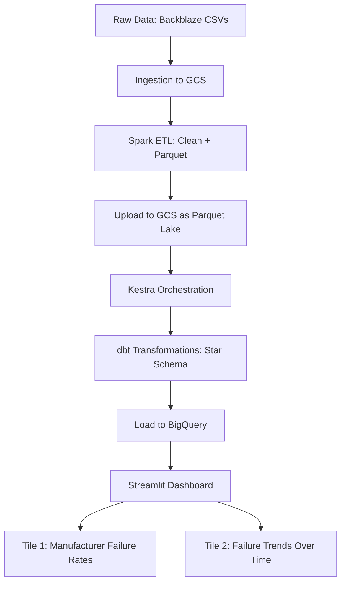

# 📊 Project Plan: Hard Drive Failure Analytics Dashboard

### 🚧 Status: Work in Progress

> **Project Title**: Hard Drive Failure Analytics Dashboard  
> **Dataset Source**: Hard Drive Test Data 
> **Cloud Provider**: Google Cloud Platform (GCP)  
> **Data Lake**: Google Cloud Storage (GCS)  
> **Data Warehouse**: BigQuery  
> **ETL & Batch Processing**: Apache Spark (Python)  
> **Data Transformation**: dbt (Python + SQL)  
> **Orchestration**: Kestra  
> **Dashboard**: Streamlit  
> **Infrastructure as Code**: Terraform  
> **Containerization**: Docker  

---

## 📖 Table of Contents

1. Project Overview  
2. Dataset & Scope  
3. Architecture & Data Flow
4. Technology Stack  
5. Phase-by-Phase Implementation Plan  

---

## 📌 Project Overview

This project will ingest, process, transform, and visualize Backblaze’s hard drive failure dataset to build a dashboard that displays:

- **Tile 1**: Distribution of hard drive failure rates by manufacturer (categorical).  
- **Tile 2**: Failure trends over time (temporal line chart).

The pipeline will be **batch-oriented**, orchestrated via Kestra, with Spark for ETL, dbt for transformations, BigQuery for storage, and Streamlit for the dashboard. Infrastructure will be provisioned via Terraform and containerized using Docker.

---

## 📦 Dataset & Scope

- **Source**: Backblaze Hard Drive Test Data
- **Format**: CSV (multiple files)  
- **Columns of Interest**:  
  - `model` (manufacturer)  
  - `failure_date`  
  - `failure_indicator`  
  - `smart_attrs`   
- **Scope**:  
  - Focus on failure trends and manufacturer reliability.  
  - Time range: 2020–2025 (as available).  
  - Data cleaning: handle missing values, standardize dates, deduplicate.

---

## 🔄 Architecture & Data Flow

> **Notes**:  
> - **GCS** serves as the data lake (raw and processed Parquet).  
> - **Spark** runs batch jobs (e.g., `spark-submit` or via Kestra job).  
> - **dbt** runs transformations (e.g., `dbt run` after Kestra triggers).  
> - **BigQuery** stores final star schema tables.  
> - **Streamlit** pulls data from BigQuery via `google-cloud-bigquery` Python client.

---

## 🛠️ Technology Stack

| Layer              | Technology             | Purpose                                                                 |
|--------------------|------------------------|-------------------------------------------------------------------------|
| Cloud              | Google Cloud           | Hosting GCS, BigQuery, Compute Engine, Kestra                         |
| Data Lake          | Google Cloud Storage   | Raw and processed Parquet data storage                                |
| Data Warehouse     | BigQuery               | Optimized storage and querying for dashboard                         |
| Batch Processing   | Apache Spark (Python)  | ETL jobs (cleaning, aggregating)                                      |
| Orchestration      | Kestra                 | Schedule Spark jobs, dbt runs, and dashboard refreshes                |
| Data Transformation| dbt                    | Define transformations (e.g., star schema)                            |
| Dashboard          | Streamlit              | Interactive UI with two tiles                                         |
| Infrastructure     | Terraform              | Provision GCS, BigQuery, Kestra, compute instances                    |
| Containerization   | Docker                 | Package Spark, dbt, and Streamlit apps for reproducibility            |
| CI/CD (Optional)   | GitHub Actions         | Automate Terraform, dbt, and Kestra deployments                       |

---

## 🗂️ Phase-by-Phase Implementation Plan

### Phase 1: Setup & Infrastructure
- Create GCP project, enable APIs (Storage, BigQuery, Compute, Kestra).
- Write Terraform code to provision:
  - GCS bucket (`data-lake`)
  - BigQuery dataset (`hard_drive`)
  - Kestra cluster (via Terraform or GCP Marketplace)
  - Compute instance for Spark (optional)
- Dockerize Spark + dbt + Streamlit apps.
- Set up GitHub Actions for Terraform deployment.

### Phase 2: Data Ingestion & ETL
- Write Spark job to:
  - Ingest CSVs from Backblaze.
  - Clean data (remove duplicates, handle missing values).
  - Write to GCS as Parquet (partitioned by `failure_date`).
- Configure Kestra to trigger Spark job daily.
- Validate data in GCS.

### Phase 3: Data Transformation
- Write dbt models:
  - `stg_drives`: raw Parquet data.
  - `dim_manufacturer`: deduplicated manufacturer table.
  - `fact_failures`: aggregated failures by manufacturer + date.
  - `dim_date`: date dimension (partitioned).
- Use `dbt run` in Kestra.
- Validate schema and data in BigQuery.

### Phase 4: Dashboard
- Build Streamlit app:
  - Connect to BigQuery via `google-cloud-bigquery`.
  - Create two tiles:
    1. Bar chart: Failure rates by manufacturer.
    2. Line chart: Failures over time.
  - Add titles, labels, and interactivity.
- Deploy Streamlit app.

### Phase 5: Documentation & Peer Review
- Complete README.md with:
  - Project description.
  - Architecture diagram.
  - Setup instructions.
  - How to run each component.
  - Evaluation criteria mapping.
- Prepare 3 peer reviews.